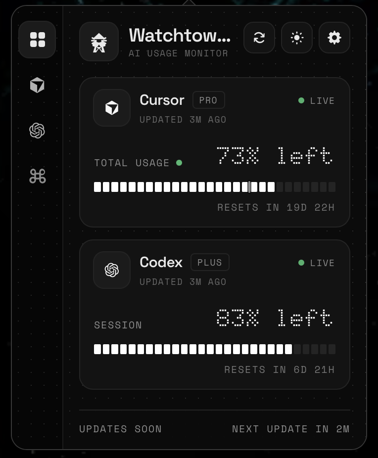

# Watchtower

Opinionated OpenUsage for Codex, Cursor, Claude, OpenCode and Gemini.

<p align="center">
  
</p>

## Install

```sh
brew install --cask keshav-k3/tap/watchtower
xattr -dr com.apple.quarantine /Applications/watchtower.app
```

## Upgrade

```sh
brew upgrade --cask keshav-k3/tap/watchtower
```
